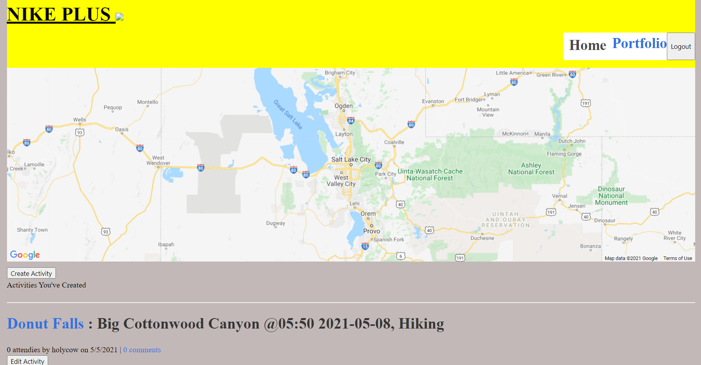
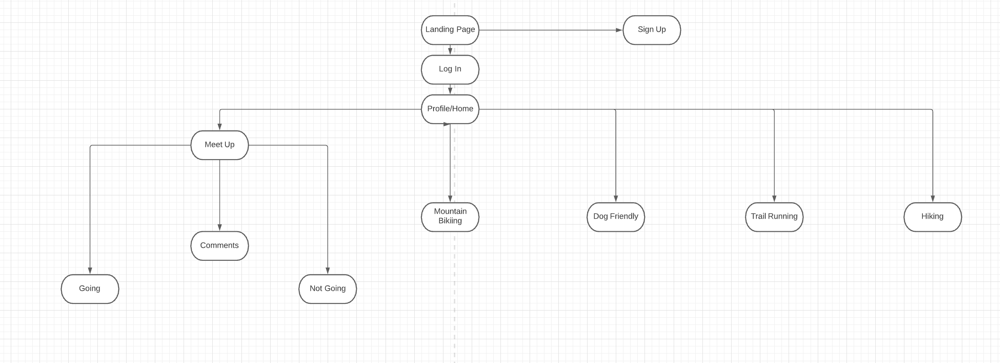

# NIKE PLUS

## Description:

An app where outdoorsy folks can get together and plan an activity such as hiking, trail running, and mtn biking. User will need to sign in to contribute to the app.User can create a post with a trailhead and put a time for a meet up. User will be able to join others activities by clicking the going button. User will able to comment on activity posts. User will be able to edit and delete their own posts. 

## Licensing:

## Table of Contents 
* [Description](#description)
* [Installation](#installation)
* [Usage](#usage)
* [Technology](#technology)
* [Contributors](#contributors)
* [Screenshot](#Screenshot)
* [Flowchart](#flowchart)

## Installation:
- MySQL2
- express-handlebars
- sequelize
- dotenv
- bcrypt
- express-session
- connect-session-sequelize

## Usage:
- https://secret-oasis-75633.herokuapp.com/

## Technology:
- Express.js
- Node.js
- Handlebars
- Javascript
- Heroku
- Schema
- MVC

## Contributors:
Tess, Brad & Gage 

## Screenshot:

## Flowchart:
 
